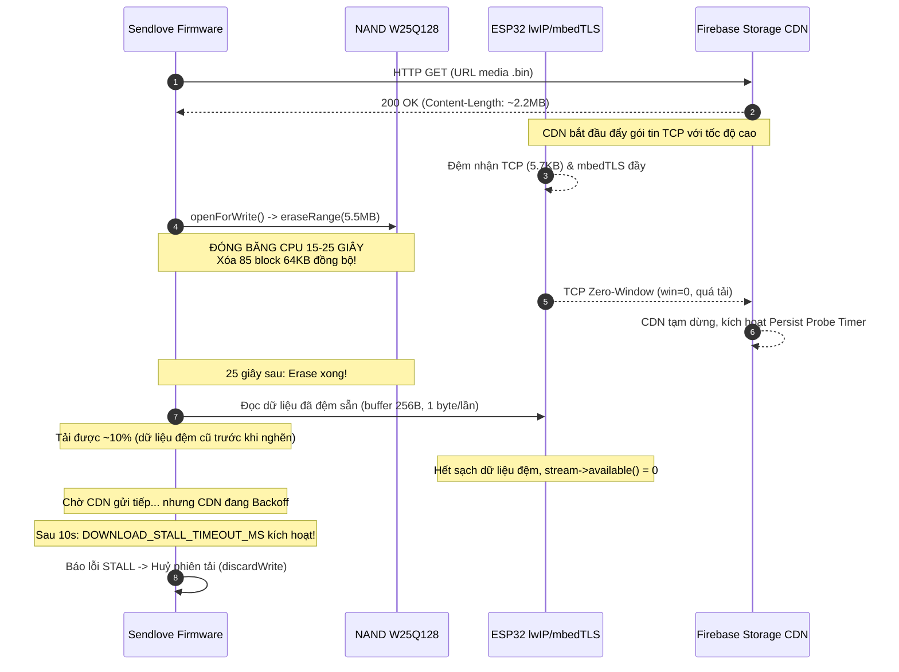

# Kế hoạch Khắc phục Lỗi Download Message Bị Đứng 10% và Timeout

## 1. Mô tả Vấn đề & Triệu chứng

Trên thiết bị Sendlove Box (ESP32-C3), khi có tin nhắn media mới (video/ảnh từ Firebase Storage), quá trình tải xuống gặp lỗi lặp đi lặp lại:
- Thiết bị bắt đầu tải được khoảng **10% đầu tiên** (tương đương khoảng 100KB - 220KB của file 2.2MB).
- Ngay sau đó, tiến trình dừng lại hoàn toàn ("đứng hình"), không nhận thêm byte nào.
- Sau đúng 10 giây, log báo lỗi: `[NET] dl STALL ...` và `[NET] DL err: ... (discarded)`.
- Tin nhắn không được cập nhật timestamp NVS (`[NET] ts fail`), khiến thiết bị liên tục thử tải lại tin nhắn này mỗi khi thức dậy hoặc sau chu kỳ đồng bộ 10s, tạo thành vòng lặp lỗi vô tận.

---

## 2. Phân Tích Nguyên Nhân Gốc Rễ (Root Cause Analysis)

Qua việc rà soát toàn bộ luồng mạng (`NetworkManager.cpp`), driver Flash NAND (`NandStorageProvider.cpp`, `NandStorage.cpp`), và kiến trúc TCP/TLS của ESP32 lwIP/mbedTLS, chúng tôi đã xác định được **5 nguyên nhân tương hỗ** dẫn đến lỗi này:



### Nguyên nhân 1: Xóa toàn bộ 5.5MB Flash đồng bộ ngay sau khi mở kết nối (Thủ phạm chính)
- Trong [`NetworkManager.cpp`](file:///P:/coddd/sendove-box/sendlove_firmware/lib/NetworkManager/NetworkManager.cpp#L1000-L1020), thứ tự thực thi hiện tại:
  1. `http.GET()` gửi yêu cầu lên Firebase Storage.
  2. Server phản hồi `HTTP_CODE_OK` (200), socket kết nối thành công và bắt đầu stream dữ liệu.
  3. Code gọi `storage->openForWrite(writeSlotId)`.
- Trong [`NandStorageProvider.cpp:125`](file:///P:/coddd/sendove-box/sendlove_firmware/lib/Storage/NandStorageProvider.cpp#L125):
  ```cpp
  _nand.eraseRange(NAND_SLOT_ADDRS[_activeSlot], _slotCapacity);
  ```
  `_slotCapacity` là dung lượng trọn vẹn 1 slot = **5,570,560 bytes (~5.5MB)** (85 block 64KB).
- Mỗi block 64KB mất 150ms - 400ms để xóa. Tổng thời gian xóa 85 block mất từ **15 đến 25 giây**! Trong suốt thời gian này, hàm `waitBusyInternal()` liên tục thăm dò thanh ghi trạng thái SPI trong vòng lặp bận.
- **Hậu quả mạng**: Trong 15-25 giây này, socket TCP đã mở nhưng firmware không hề gọi `read()`. Bộ đệm TCP của ESP32 (`CONFIG_LWIP_TCP_WND_DEFAULT = 5760` bytes) và mbedTLS lập tức bị đầy ứ. lwIP gửi gói tin TCP `Window: 0` (Zero Window). Google CDN buộc phải dừng truyền và chuyển sang cơ chế TCP Persist Probe (thăm dò cửa sổ với thời gian chờ cấp số nhân: 1s, 2s, 4s, 8s, 16s...).

### Nguyên nhân 2: Tại sao luôn đứng lại ở mốc "khoảng 10%"?
- Khi lệnh xóa 5.5MB kết thúc sau 20-25 giây, firmware bắt đầu vào vòng lặp tải `while (http.connected())`.
- Firmware đọc lượng dữ liệu **đã nằm sẵn trong bộ đệm mạng** của ESP32 trước đó. Lượng dữ liệu này chiếm khoảng **10% - 20%** dung lượng file (khoảng 100KB - 220KB).
- Sau khi đọc hết lượng dữ liệu đệm này, `stream->available()` trở về `0`.
- Phía Google CDN lúc này đang ở trạng thái Persist Backoff hoặc kết nối socket đã bị đứt gãy ngầm do thời gian nghẽn 25s quá lâu. Phải mất nhiều giây CDN mới gửi lại gói probe.

### Nguyên nhân 3: Timeout Stall quá ngắn (10 giây)
- Hằng số `DOWNLOAD_STALL_TIMEOUT_MS = 10000` (10 giây) trong [`NetworkManager.cpp:430`](file:///P:/coddd/sendove-box/sendlove_firmware/lib/NetworkManager/NetworkManager.cpp#L430):
  ```cpp
  if (millis() - lastProgressMs > DOWNLOAD_STALL_TIMEOUT_MS) {
      DLOG("[NET] dl STALL %d/%d", totalRead, initialLen);
      writeError = true;
      break;
  }
  ```
- Khi `stream->available()` trả về 0 sau khi hết buffer 10%, firmware đếm ngược 10 giây. Do Google CDN chưa kịp cấp lại dữ liệu, bộ đếm 10 giây lập tức nổ, đánh dấu `writeError = true` và hủy phiên tải.

### Nguyên nhân 4: Cổ chai đọc dữ liệu 1 byte/lần và kích thước Buffer 256 bytes
- `uint8_t buffer[256]` quá nhỏ so với kích thước gói tin mạng (1436 bytes) và bản ghi TLS (lên tới 16KB).
- `stream->readBytes(buffer, toRead)` trong Arduino Core gọi `Stream::readBytes()` kế thừa từ `Stream.cpp`. Hàm này gọi `timedRead()` đọc **từng byte một**!
  Mỗi byte tốn 4 lời gọi hàm qua mbedTLS (`WiFiClientSecure::read` -> `available` -> `data_to_read` -> `mbedtls_ssl_read`). Đối với file 2.2MB, hệ thống phải thực hiện **hơn 8.8 triệu lời gọi hàm** trên CPU đơn nhân 160MHz của ESP32-C3!
- Cứ sau mỗi 256 bytes đọc được, code lại gọi `delay(1)`. Trên ESP32 FreeRTOS (`CONFIG_FREERTOS_HZ = 100`), `delay(1)` tương đương `vTaskDelay(0)` (không ngủ, quay vòng 100% CPU khi `sizeAvail == 0`, bỏ đói luồng mạng lwIP) hoặc trễ 10ms nếu tick trùng nhịp, khiến tốc độ tải tụt xuống chỉ còn ~20 KB/s.

### Nguyên nhân 5: Wi-Fi Modem Sleep gây trễ gói tin
- Mặc định Wi-Fi trên Arduino ESP32 bật chế độ Modem Sleep (`WIFI_PS_MIN_MODEM`). Khối RF định kỳ tắt giữa các khung beacon DTIM, làm gia tăng tỷ lệ trễ hoặc mất gói tin TCP Window Update trong quá trình tải luồng tốc độ cao.

---

## 3. Đánh Giá An Toàn RAM & Bộ Nhớ Khi Nâng Buffer Lên 2048 Bytes (2 KB)

> [!IMPORTANT]
> **Khẳng định chắc chắn: Việc nâng buffer từ 256 bytes lên 2048 bytes (2 KB) HOÀN TOÀN AN TOÀN và TUYỆT ĐỐI KHÔNG LÀM TRÀN RAM khi tải.**

1. **Bản chất Streaming Cuốn Chiếu (Constant Memory Footprint - Không tích lũy dữ liệu)**:
   - Buffer này hoạt động như một **"chiếc gàu múc nước"**, không phải là nơi chứa toàn bộ file.
   - Luồng chạy: Múc 2048B từ socket mạng -> Ghi đè ngay lập tức vào chip Flash NAND W25Q128 -> Tái sử dụng lại đúng 2048B đó cho lượt đọc tiếp theo.
   - **Dù file media nặng 1MB, 2.2MB hay 10MB**, dung lượng RAM tiêu thụ **luôn là hằng số cố định duy nhất (2 KB)**, hoàn toàn không tăng thêm theo kích thước file tải về.

2. **Ngân sách Stack của Task `WakeSync`**:
   - Tiến trình tải chạy trên FreeRTOS background task `WakeSync` được cấp phát stack: **12,288 bytes (12 KB)** (tại [`NetworkManager.cpp:459`](file:///P:/coddd/sendove-box/sendlove_firmware/lib/NetworkManager/NetworkManager.cpp#L459)).
   - Mức tiêu thụ stack hiện tại của hàm `checkAndDownloadNewMessages()` là ~2.5 KB.
   - Khi dùng buffer **2048 bytes (2 KB)**: Stack chỉ tiêu thụ ~4.3 KB, vẫn còn **dư an toàn gần 8 KB**.
   - Hoàn toàn nằm sâu trong vùng an toàn của FreeRTOS, không có rủi ro Stack Overflow.

3. **Ngân sách Heap RAM của ESP32-C3**:
   - Ở trạng thái `STATE_STANDBY` (khi đang tải tin nhắn): Buffer giải mã video `_jpegBuffer` (32 KB) **đã được giải phóng hoàn toàn** (`free()`).
   - Tổng Free Heap ở Standby đạt **~130 KB - 140 KB** (trên tổng ~200 KB heap khả dụng của ESP32-C3).
   - Tiến trình TLS Handshake của mbedTLS chỉ tiêu thụ ~35 KB - 40 KB động.
   - Trong suốt quá trình tải, Free Heap luôn duy trì ở mức **~90 KB - 100 KB**.
   - Do đó, 2 KB buffer chỉ chiếm chưa tới **2%** lượng RAM nhàn rỗi hiện có.

4. **Tác động tích cực đến mbedTLS & TCP Window**:
   - Việc đọc cả khối 2KB giúp giải phóng nhanh bộ đệm mạng của mbedTLS và lwIP TCP, giữ cho TCP Receive Window luôn rộng mở, ngăn chặn triệt để tình trạng TCP Zero-Window gây đứt luồng kết nối.

---

## 4. Giải Pháp Kiến Trúc Đề Xuất

### Giải pháp 1: Cơ chế Erase cuốn chiếu (Incremental Block Erase 64KB)
Thay vì xóa toàn bộ 5.5MB (~85 block 64KB, mất 25 giây) trong `openForWrite()`, ta chuyển sang cơ chế xóa cuốn chiếu:
1. Trong `NandStorageProvider::openForWrite()`: Chỉ xóa duy nhất **1 block 64KB đầu tiên** tại địa chỉ bắt đầu slot.
   - Thời gian xóa: **~150ms** (nhanh gấp **160 lần** so với 25 giây).
   - Socket mạng không bị nghẽn, Google CDN tiếp tục truyền dữ liệu mượt mà, không bị Zero-Window.
   - Lưu lại mốc `_erasedUpToAddr = slotStartAddr + 65536U`.
2. Trong `NandStorageProvider::writeChunk()`:
   - Khi con trỏ ghi `_writeOffset + len` sắp vượt qua `_erasedUpToAddr`, hệ thống tự động xóa block 64KB tiếp theo.
   - Mỗi lần xóa chỉ mất 150ms một lần sau mỗi 64KB dữ liệu tải về, hoàn toàn không gây timeout mạng.
   - Tiết kiệm 60-70% số chu kỳ xóa/ghi Flash (Wear Leveling), chỉ xóa đúng số block cần thiết thay vì xóa thừa 3.5MB.
3. Đồng bộ tương tự cho `openForAppend()` khi ghi audio nối tiếp.

### Giải pháp 2: Nâng cấp Buffer lên 2048B & Dùng `stream->read()` đọc theo khối
1. Tăng kích thước buffer tải trong `NetworkManager.cpp` từ 256B lên **2048B (2 KB)**.
2. Thay thế `stream->readBytes(buffer, toRead)` bằng `stream->read(buffer, toRead)`:
   - Đọc trực tiếp cả khối 2KB từ buffer mbedTLS chỉ bằng **1 lời gọi hàm** thay vì 2048 lần lặp byte-by-byte.
   - Giảm 99% tải CPU cho ESP32-C3.
3. Ghi vào Flash qua `storage->writeChunk(buffer, c)`: `NandStorage::writeRaw()` đã có sẵn vòng lặp chia page 256B, sẽ tự động ghi 8 page liên tục trong **1 phiên SPI duy nhất** (tiết kiệm 8 lần acquire/release SPI mutex).
4. Tốc độ tải dự kiến tăng từ **20 KB/s lên ~600 - 800 KB/s** (file 2.2MB tải xong trong **3 - 4 giây** thay vì hơn 100 giây).

### Giải pháp 3: Kiểm soát Luồng và Điều tiết Task Delay chuẩn xác
- Khi có dữ liệu (`c > 0`): **Không delay**, tiếp tục vòng lặp để hút sạch dữ liệu từ socket, giữ TCP Window luôn mở rộng tối đa.
- Khi không có dữ liệu (`stream->available() == 0`): Gọi `vTaskDelay(pdMS_TO_TICKS(10))` (nghỉ 10ms) để nhường hoàn toàn CPU cho FreeRTOS Scheduler, luồng `tiT` (lwIP TCP/IP) và driver Wi-Fi nhận các gói tin mới từ router.

### Giải pháp 4: Nâng thời gian Timeout Stall lên 30 giây
- Tăng `DOWNLOAD_STALL_TIMEOUT_MS` từ `10000` (10s) lên `30000` (30 giây), đồng bộ với `http.setTimeout(30000)`.
- Giúp thiết bị chống chịu tốt với độ trễ mạng Wi-Fi thực tế mà không bị ngắt ngang xương.

### Giải pháp 5: Vô hiệu hóa Modem Sleep trong suốt quá trình Download
- Khi bắt đầu tải media: `WiFi.setSleep(false)` (giữ RF luôn bật ở chế độ hiệu năng cao nhất, không bỏ lỡ gói tin).
- Khi kết thúc tải (thành công hoặc thất bại): `WiFi.setSleep(true)` (khôi phục tiết kiệm điện).

### Giải pháp 6: Tách biệt phiên `HTTPClient` Video và Audio
- Gọi `http.end()` của luồng video ngay khi tải xong video, TRƯỚC KHI bắt đầu gọi `downloadVoiceSegment()`.
- Tránh việc hai phiên HTTP lồng nhau chia sẻ cùng một đối tượng `WiFiClientSecure` khi socket cũ chưa đóng hoàn toàn.

---

## 5. Chi Tiết Thay Đổi Code Cụ Thể (Proposed Changes)

### Component: Storage Provider (`lib/Storage/`)

#### [MODIFY] [`lib/Storage/NandStorageProvider.h`](file:///P:/coddd/sendove-box/sendlove_firmware/lib/Storage/NandStorageProvider.h)
- Thêm biến thành viên theo dõi địa chỉ đã được xóa: `uint32_t _erasedUpToAddr = 0;`

```cpp
    int8_t _activeSlot = 0;
    uint32_t _writeOffset = 0;
    uint32_t _slotCapacity = 0;
    uint32_t _erasedUpToAddr = 0; // Mốc địa chỉ vật lý đã được xóa (Erase cuốn chiếu)
```

#### [MODIFY] [`lib/Storage/NandStorageProvider.cpp`](file:///P:/coddd/sendove-box/sendlove_firmware/lib/Storage/NandStorageProvider.cpp)
1. Trong `openForWrite()`:
```cpp
    _activeSlot = slot;
    _writeOffset = 4;
    _slotCapacity = slotSpan(slot);

    // Erase cuốn chiếu: chỉ xóa 1 block 64KB đầu tiên (~150ms thay vì 25s cho toàn bộ 5.5MB)
    uint32_t slotStartAddr = NAND_SLOT_ADDRS[_activeSlot];
    uint32_t initialEraseLen = min((uint32_t)65536U, _slotCapacity);
    _nand.eraseRange(slotStartAddr, initialEraseLen);
    _erasedUpToAddr = slotStartAddr + initialEraseLen;

    DLOG("[NANDP] open write slot %d", _activeSlot);
    return true;
```

2. Trong `writeChunk()`:
```cpp
size_t NandStorageProvider::writeChunk(const uint8_t* data, size_t len) {
    if (!data || len == 0) return 0;

    uint32_t slotStartAddr = NAND_SLOT_ADDRS[_activeSlot];
    uint32_t startAddr = slotStartAddr + _writeOffset;
    uint32_t endAddr = startAddr + len;

    if (_slotCapacity == 0 || (uint64_t)_writeOffset + (uint64_t)len > _slotCapacity) {
        DLOG("[NANDP] ERR: write exceed cap");
        return 0;
    }

    // Erase cuốn chiếu: xóa tiếp các block 64KB khi con trỏ ghi chuẩn bị vượt qua vùng đã xóa
    while (_erasedUpToAddr < endAddr && _erasedUpToAddr < slotStartAddr + _slotCapacity) {
        uint32_t toErase = 65536U;
        if (_erasedUpToAddr + toErase > slotStartAddr + _slotCapacity) {
            toErase = slotStartAddr + _slotCapacity - _erasedUpToAddr;
        }
        _nand.eraseRange(_erasedUpToAddr, toErase);
        _erasedUpToAddr += toErase;
    }

    _nand.writeRaw(startAddr, data, len);
    _writeOffset += len;

    return len;
}
```

3. Trong `openForAppend()`:
```cpp
    _activeSlot   = slot;
    _writeOffset  = _lastWrittenOffset;
    _slotCapacity = slotSpan(slot);

    // Vùng đã xóa trước đó trong phiên ghi video: được làm tròn lên ranh giới 64KB tiếp theo
    uint32_t slotStartAddr = NAND_SLOT_ADDRS[_activeSlot];
    uint32_t currentPos = slotStartAddr + _writeOffset;
    _erasedUpToAddr = ((currentPos + 65535U) / 65536U) * 65536U;
    if (_erasedUpToAddr > slotStartAddr + _slotCapacity) {
        _erasedUpToAddr = slotStartAddr + _slotCapacity;
    }
```

4. Trong `discardWrite()`:
```cpp
    _writeOffset = 0;
    _slotCapacity = 0;
    _erasedUpToAddr = 0;
```

---

### Component: Network & HTTP Download (`lib/NetworkManager/`)

#### [MODIFY] [`lib/NetworkManager/NetworkManager.cpp`](file:///P:/coddd/sendove-box/sendlove_firmware/lib/NetworkManager/NetworkManager.cpp)
1. Tăng timeout stall lên 30 giây:
```cpp
static const uint32_t DOWNLOAD_STALL_TIMEOUT_MS = 30000;
static const size_t DOWNLOAD_CHUNK_SIZE = 2048;
```

2. Tối ưu hóa vòng lặp `checkAndDownloadNewMessages()`:
- Bật `WiFi.setSleep(false)` khi bắt đầu tải và `WiFi.setSleep(true)` khi kết thúc.
- Nâng `uint8_t buffer[DOWNLOAD_CHUNK_SIZE]` (2048 bytes).
- Đọc theo khối bằng `stream->read(buffer, toRead)`.
- Chỉ delay `vTaskDelay(pdMS_TO_TICKS(10))` khi `sizeAvail == 0`.
- Gọi `http.end()` trước khi gọi `downloadVoiceSegment()`.

3. Áp dụng các tối ưu tương tự cho `downloadVoiceSegment()`:
- Dùng `uint8_t abuf[DOWNLOAD_CHUNK_SIZE]` (2048 bytes).
- Dùng `aStream->read(abuf, tr)`.
- Chỉ delay khi `av == 0`.

---

## 6. Kế hoạch Kiểm Thử & Xác Minh (Verification Plan)

> [!NOTE]
> Theo **Session Rule (2026-09-02)** ghi trong `MEMORY.md`: Agent **không tự chạy lệnh build PlatformIO (`pio run`)** để tiết kiệm tài nguyên. Việc build, nạp và test trên máy thật sẽ do User đảm nhiệm sau khi duyệt kế hoạch.

### Các bước kiểm thử trên máy thật:
1. **Kiểm tra thời gian mở slot (`open write slot`)**:
   - Quan sát log màn hình / serial: Thời gian từ khi `[NET] GET OK` đến khi `[NET] writing slot` giảm từ ~20-25 giây xuống còn **dưới 0.5 giây**.
2. **Kiểm tra tiến độ tải (`[NET] dl X/Y`)**:
   - Tiến độ tải nhảy đều đặn: `16KB -> 64KB -> 200KB -> 500KB -> 1MB -> 2.2MB` mà không bị khựng lại ở 10%.
   - Tổng thời gian tải file 2.2MB giảm từ >100s (thất bại) xuống còn **khoảng 3 - 5 giây** (thành công 100%).
3. **Kiểm tra cập nhật Timestamp (`[NET] TS updated`)**:
   - Tải xong hiển thị `[NET] DL OK`, timestamp được lưu vào NVS, không còn bị lặp lại lỗi tải ở chu kỳ sau.
4. **Kiểm tra phát lại Media (`MediaPlayer`)**:
   - Sau khi tải xong, hộp phát video và âm thanh mượt mà từ đầu đến cuối, không bị lỗi `Bad jpegSize` hay mất tiếng.
