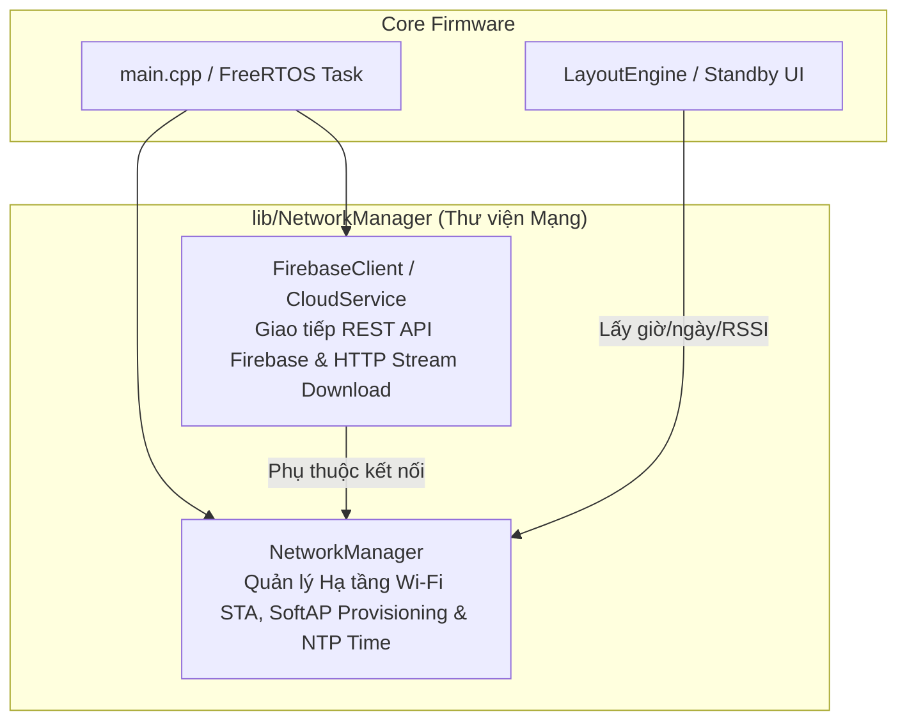

```mermaid
graph TD
    subgraph NetworkLib ["lib/NetworkManager (Thư viện Mạng)"]
        NM[NetworkManager<br>Quản lý Hạ tầng Wi-Fi STA, SoftAP Provisioning & NTP Time]
        FC[FirebaseClient / CloudService<br>Giao tiếp REST API Firebase & HTTP Stream Download]
    end

    subgraph AppCore ["Core Firmware"]
        MAIN[main.cpp / FreeRTOS Task]
        UI[LayoutEngine / Standby UI]
    end

    MAIN --> NM
    MAIN --> FC
    UI -->|Lấy giờ/ngày/RSSI| NM
    FC -->|Phụ thuộc kết nối| NM


```